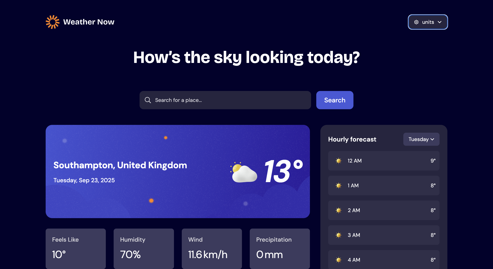

# Frontend Mentor - Weather app solution

This is a solution to the [Weather app challenge on Frontend Mentor](https://www.frontendmentor.io/challenges/weather-app-K1FhddVm49). Frontend Mentor challenges help you improve your coding skills by building realistic projects.

## Table of contents

- [Overview](#overview)
  - [The challenge](#the-challenge)
  - [Screenshot](#screenshot)
  - [Links](#links)
- [My process](#my-process)
  - [Built with](#built-with)
  - [What I learned](#what-i-learned)
  - [Continued development](#continued-development)
  - [Useful resources](#useful-resources)
- [Author](#author)

## Overview

### The challenge

Users should be able to:

- Search for weather information by entering a location in the search bar
- View current weather conditions including temperature, weather icon, and location details
- See additional weather metrics like "feels like" temperature, humidity percentage, wind speed, and precipitation amounts
- Browse a 7-day weather forecast with daily high/low temperatures and weather icons
- View an hourly forecast showing temperature changes throughout the day
- Switch between different days of the week using the day selector in the hourly forecast section
- Toggle between Imperial and Metric measurement units via the units dropdown
- Switch between specific temperature units (Celsius and Fahrenheit) and measurement units for wind speed (km/h and mph) and precipitation (millimeters) via the units dropdown
- View the optimal layout for the interface depending on their device's screen size
- See hover and focus states for all interactive elements on the page

### Screenshot



### Links

- Solution URL: [https://github.com/mrvicthor/new-weather-app]
- Live Site URL: [https://new-weather-app-eight.vercel.app/]

## My process

### Built with

- Semantic HTML5 markup
- CSS custom properties
- Flexbox
- CSS Grid
- Mobile-first workflow
- [React](https://reactjs.org/) - JS library
- [Motion](https://motion.dev/docs/react) - Motion for React
- [TailwindCSS](https://tailwindcss.com/) - For styles
- [TanStack Query](https://tanstack.com/query/latest) - Powerful asynchronous state management, server-state utilities and data fetching

### What I learned

Working with React Query taught me how to manage server state declaratively. I used query keys to separate search results from weather details, which allowed React Query to cache and reuse data efficiently. I also learned to use the enabled flag to conditionally trigger queries, staleTime to control freshness, and even combined multiple API calls with Promise.all. Overall, React Query helped me simplify data fetching logic, reduce boilerplate, and provide a smoother UX with cached results and background updates.

```js
function useWeather(latitude: number, longitude: number) {
  return useQuery({
    queryKey: ["location", latitude, longitude],
    queryFn: async () => {
      if (latitude == null || longitude == null)
        return Promise.reject("No location");
      const [location, weather] = await Promise.all([
        fetchLocation(Number(latitude), Number(longitude)),
        fetchWeatherDetails(Number(latitude), Number(longitude)),
      ]);

      return { location, weather };
    },
    staleTime: 1000 * 60, // 5 minutes
    enabled: latitude != null && longitude != null,
  });
}
```

### Continued development

I am going to continue practicing Test Driven Development (TDD)

### Useful resources

- [Frontend Mentor](https://www.frontendmentor.io/challenges/weather-app-K1FhddVm49) - This helped me with the resources to complete this challenge.

## Author

- Website - [https://www.victoreleanya.com/]
- Frontend Mentor - [https://www.frontendmentor.io/profile/mrvicthor]
- Twitter - [https://x.com/eva_skillz]
